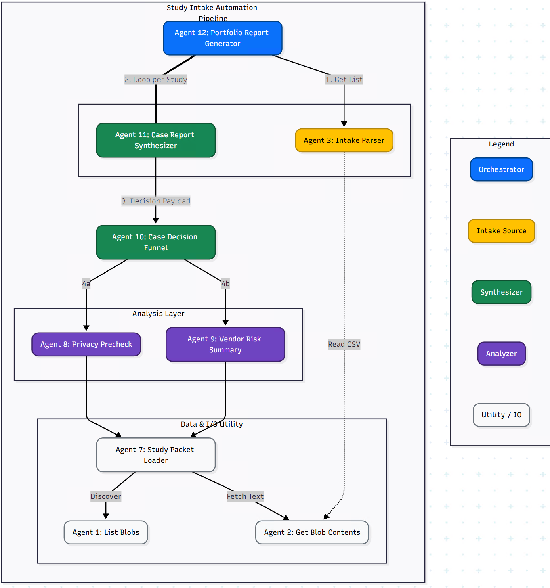

# Hackathon Challenges | Shared Rules and Constraints

Applies to all tracks: **AMC**, **Research**, **EDU**

## Table of Contents
1. [Context](#context)
2. [Required deliverable](#required-deliverable)
3. [Inputs you can assume](#inputs-you-can-assume)
4. [Platform constraints](#platform-constraints)
5. [Multi agent requirement](#multi-agent-requirement)
6. [Judging focus](#judging-focus)
7. [Recommended bundle format](#recommended-bundle-format)
8. [API connections (Blob Storage)](#api-connections-blob-storage)
   - [blob_list_blobs_container](#blob_list_blobs_container)
   - [blob_get_blob_contents](#blob_get_blob_contents)
9. [Pro tips](#pro-tips)
10. [AMC Example](#amc-example)

## Context
You are building inside an Agentic Governance Platform that turns incomplete intake requests into a structured, reviewable coordination bundle.

This is an evaluation and coordination exercise, not a deployment exercise.

## Required deliverable
Each submission must generate exactly one Markdown bundle file for the selected track.

- AMC: `study_startup_bundle.md`
- Research: `research_triage_bundle.md`
- EDU: `student_success_bundle.md`

If teams produce additional artifacts for their own workflow, that is allowed, but it is not required and will not be judged.

## Inputs you can assume
Each track provides a structured intake file in CSV format plus additional attachments.

- The CSV is the source of truth for intake fields
- Additional attachments may add context, but may be missing, partial, or contradictory
- Your workflow should tolerate missing fields and still generate a useful bundle

## Platform constraints
- Output must be fully copy and paste friendly
- Assume incomplete inputs, default to conservative routing and recommendations
- Do not claim approvals, determinations, or compliance status, you may only recommend routing, identify likely triggers, and propose next steps
- No external network calls are required for judging, use only the provided intake data and additional attachments
- Prefer structured sections and checklists over long narrative
- Track evidence and assumptions explicitly, do not bury them

## Multi agent requirement
You must implement this as a multi agent workflow.

### Minimum constraints
- Use at least 3 agents
- Use at least 2 agent types

### Agent types
You may design any agents you want, but your workflow must include both types below.

#### A. General purpose utility agents
Reusable across domains, focused on structured functions.

Examples, illustrative only:
- Intake normalizer, validates and canonicalizes fields, detects contradictions
- Evidence extractor, pulls cited facts from CSV and attachments into an evidence list
- Missing info generator, produces prioritized clarifying questions
- Risk register builder, turns findings into a structured risk and mitigation list
- Task planner, creates a sequenced checklist with owners and dependencies
- Red flag detector, highlights escalation triggers based on patterns and keywords
- Bundle assembler, enforces headings, ordering, and formatting rules for the final Markdown

#### B. Domain specific agents
Specialized reasoning and decision making for the selected track.

Examples, illustrative only:
- AMC domain agent: clinical study startup coordination and readiness decisioning
- Research domain agent: compliance trigger mapping and routing logic
- EDU domain agent: student success intervention planning with privacy and fairness guardrails

## Judging focus
Judges will look for:
- Clear evidence of distinct agent outputs combined into one final Markdown bundle
- Utility agent outputs reused across sections, and ideally reusable across tracks
- A domain specific agent producing the core track specific decisions and guidance
- Conservative handling of unknowns, with explicit assumptions and clarifying questions
- A bundle that a real reviewer could act on immediately

## Recommended bundle format
Your final Markdown bundle should be structured with:
- A clear status and rationale section
- A prioritized list of missing info and questions
- A risk and mitigation section
- A routing and next steps section with owners
- An evidence and assumptions section

You may choose your own headings, but keep the structure consistent and easy to scan.

## API connections (Blob Storage)
These API connections let agents interact with Azure Blob Storage using a dynamic endpoint. The same connections work across tracks and storage accounts by passing parameters.

### blob_list_blobs_container
**What it does**  
Lists all blobs in a specific container. Use this to discover which files exist for `assets` or a case container before deciding what to load.

**How it works**
- Method: `GET`
- URL template: `https://{{accountname}}.blob.core.windows.net/{{container}}?restype=container&comp=list`

**Parameters**
- `accountname`: storage account name (example: `criceagenthackmc`)
- `container`: container name (example: `assets`, `study-001`, `student-003`, `proj-004`)

**What it returns**  
The raw Azure list response, which includes blob names you can pass to the blob content call.

**Typical usage pattern**
1. Call this first to list blobs in `assets` or the case container.
2. Parse the returned blob names.
3. Call `blob_get_blob_contents` for the specific files you need.

### blob_get_blob_contents
**What it does**  
Fetches the contents of a single blob as text. Use this to load intake CSVs, notes, and supporting documents for a case.

**How it works**
- Method: `GET`
- URL template: `https://{{accountname}}.blob.core.windows.net/{{container}}/{{blob_name}}`

**Parameters**
- `accountname`: storage account name
- `container`: container name
- `blob_name`: exact blob path or name from the list call (example: `study_intake.csv`, `abstract.txt`, `signal_context.json`)

**What it returns**  
The raw blob contents. For this hackathon, blobs are expected to be readable text formats like `.txt`, `.csv`, or `.json`.

**Typical usage pattern**
1. Use `blob_list_blobs_container` to discover files.
2. Select the files needed for your workflow.
3. Call this API for each selected blob to load its contents into the agent’s context.

## Pro tips
- **Don’t hand write system prompts.** Use an LLM to generate them from a tight spec (role, goals, do nots, output format), then edit.
- **Make output format non negotiable.** One schema or template only, include an explicit error shape if it can’t comply.
- **Sanity test every change.** Keep 5–10 “go to” prompts (plus 2 edge cases) and rerun them anytime you tweak prompts or code.
- **Use an LLM to design the solution, stage by stage.** Upload or link the track MD, then have it propose **Stage 1 only**, then Stage 2, then Stage 3. Avoid big bang multi agent architectures early.
- **Config echo.** Before generating prompts or code, have your LLM restate the track’s AUTHORITATIVE CONFIG values verbatim. If it gets them wrong, stop and fix that first.

## AMC Example
